# Combo-Project
This Project is an Example of Ultimate Student Portfolio
* Note - Portfolio is still under construction
  Here are some pictures of the portfolio
* Dashboard # 01   
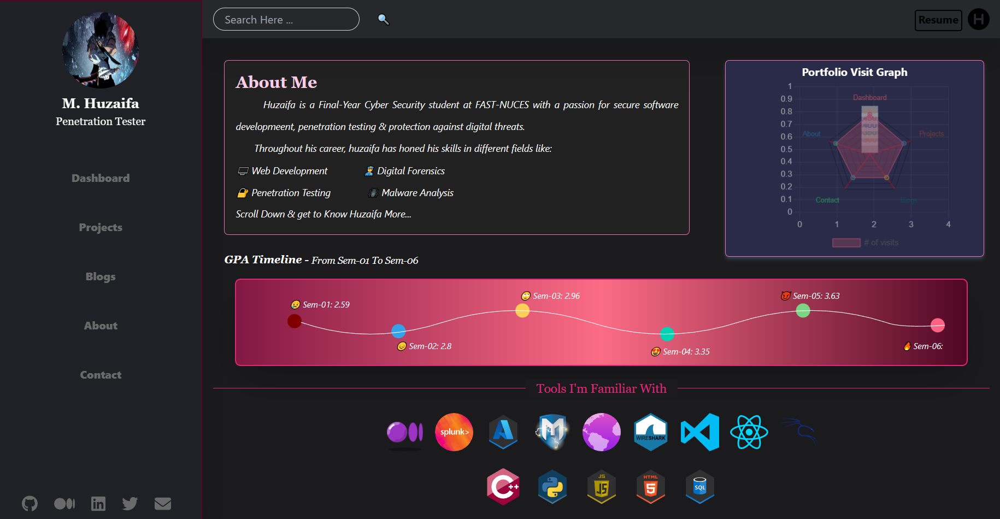 
* Dashboard # 02  
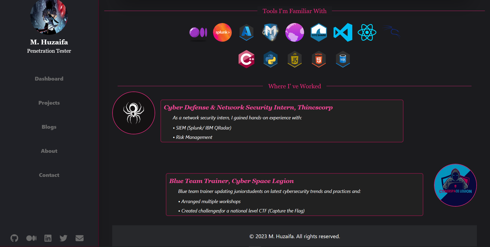 
* Projects Page - Folded Mini Projects  
 
* Projects Page - Expanded Mini Projects  
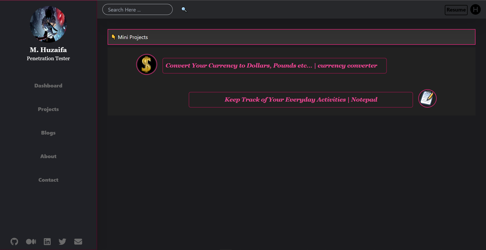 
* Mini Project # Currency Calculator  
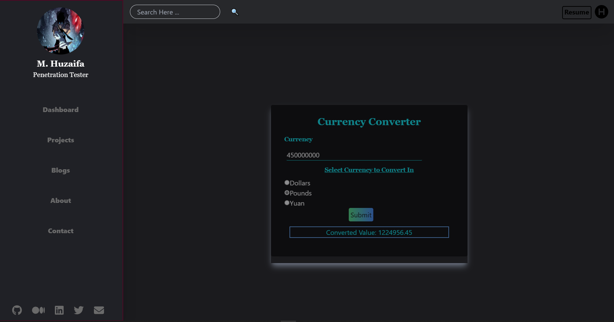 
* Mini Project # Notepad  
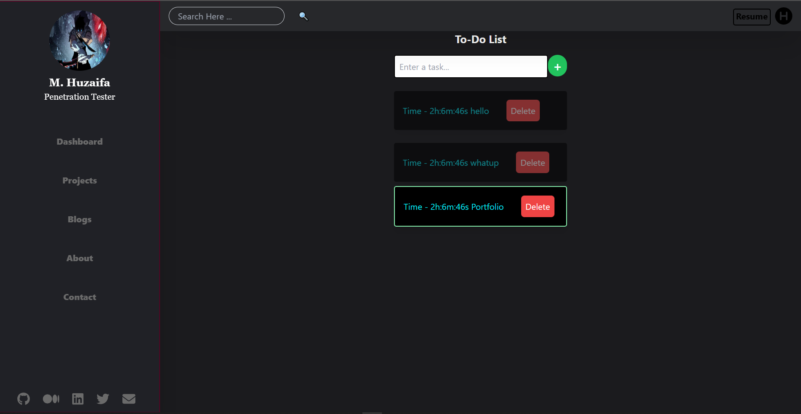 

# New Feature Added - Chat With Me
This Feature renders an interface which is responsible for the following tasks
* 1- Rules that should be abided by the user entering the chat application.
* 2- Username of the one usingthe tab to send and recieve messages.
* 3- Chat interface Like a whatsapp chat multiple Users can send and recieve messages.
* 4- Chat interface contains a form where user will type a message to send and a delete button to clear his/ her screen.
* 5- Technologies for the implementation of this chat application included the use of Socketio Server with React to broadcast the message of sender to anyone live on the chat application.

* Interface for Chat Entrence 
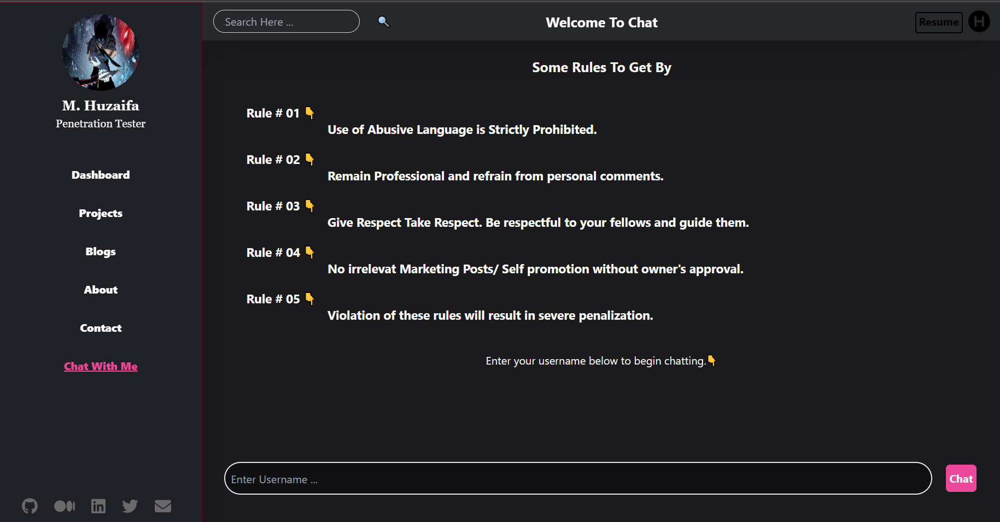  
* checks have been implemented that chat cannot be entered unless you enter a username.!   
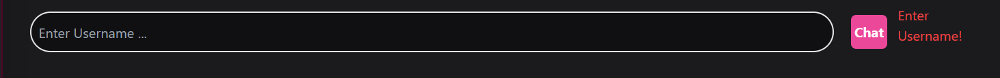  
* Checks for the detection of possible attacks in input fields have also been implemented using REGEX!  
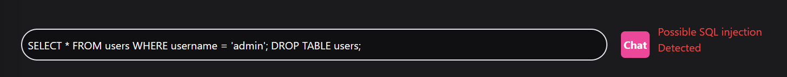  
* Upon entering Username you will get a Chat interface like this:   
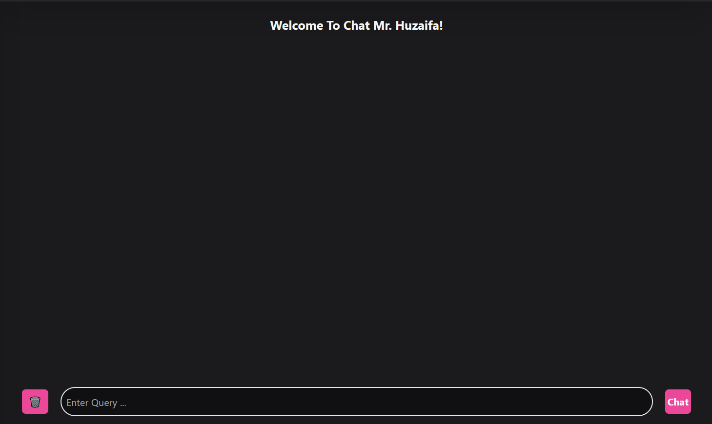  
* Let I be the sender1 and send a message as shown below:   
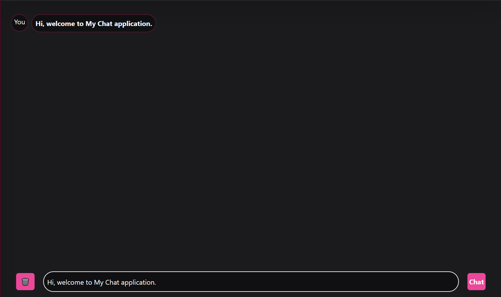  
* When 2nd user will log in he will get the broadcasted message as:   
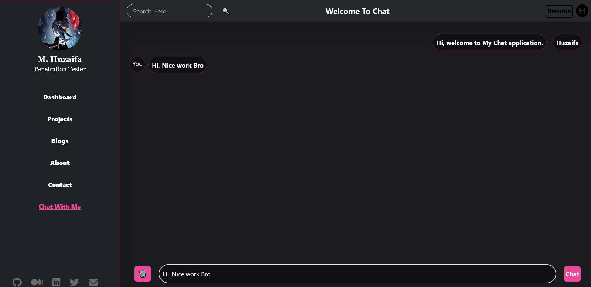  
When You will Click on Bin icon on the right the chat screen will get cleared.

# New Feature Added
This is a Login Feature for the Chat application:
* A User need to authenticate himslef before he enters the chatroom. 
* when clicking on Chat With me if user is not logged in he will be redirected to the login page. 
* After login he will get to the Chat app. 
* an additional feature of Logout button has been implemented in Chat page. 
* clciking on Logout, user will get back to login page and will not be able to get back in without logging in again. 
* Authentication is being done using firebase user authentication mechanism. 
* Logging user out on clickin back button on browser has not been implemented since it is inconvenient for user to log in again and again in a single session, however, if the page gets refreshed the user will get logged out.  
Here is what the login Page Looks Like: 
Clicked on "Chat With Me" but ended up on Login Page Since i was not logged in
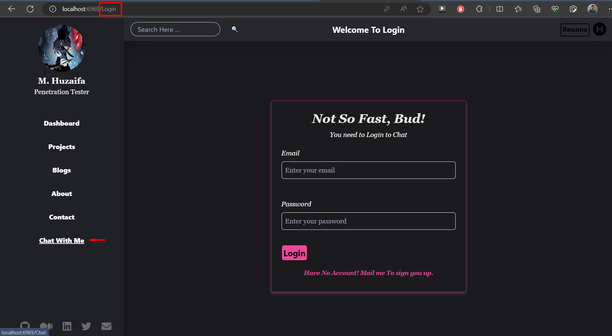  
Now let's Login
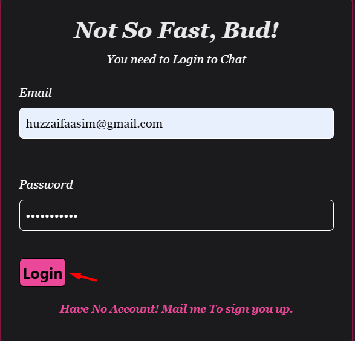  
In the Chat room, you can see the Logout button right beside the delete chat button  
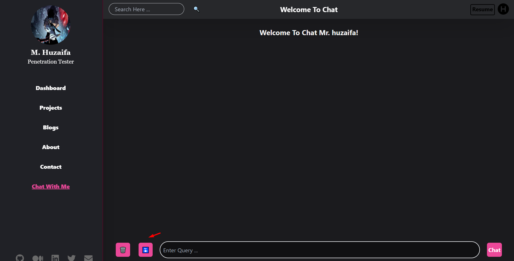  
Clciking on Logout button got me logged out of Chat rrom in to the login page and you van see that there is no forward browser button to get back into the Chat room without signing in.
  